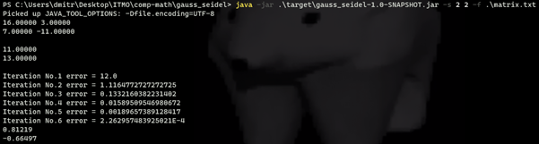
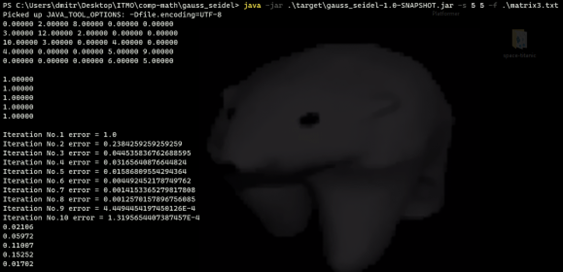
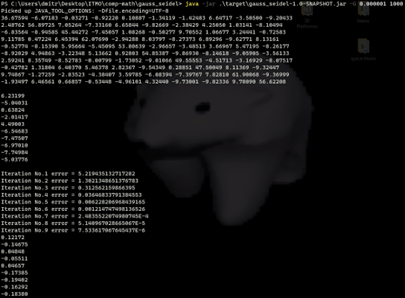

# CompMath@ITMO Spring 2023
## LabWork #1
Task: `Gauss-Seidel method`

## Usage
```
java -jar gauss-seidel.jar [options]
```
## Basic Options
```
--help, -h Outputs an overview of all available options
--size, -s [height] [width] configures the dimensions of the matrix
--random, -r [lower-bound] [upper-bound] generates input data randomly, all numbers will be within the specified range, default input is random numbers from -10.0 to 10.0
--stdin, -c configures the application to read the input from a file, default input is random numbers from -10.0 to 10.0
--file, -f [path-to-file] configures the application to read the input from a file, default input is random numbers from -10.0 to 10.0
--gauss-seidel, -G [error-threshold] [max-iterations] - specify this option to use the Gauss-Seidel iterative method to solve, default method is Gauss-Seidel method using a maximum of 1000 iterations and an epsilon value of 1.0E-4
--debug, -d specify this option to output debug information, by default this option is off
--time, -t toggles the timer to test the performance of the program, by default this option is off
```

## Demos
### Demo 1 - 2x2 matrix from file

### Demo 2 - 5x5 matrix from file

### Demo 3 - 10x10 randomly generated matrix
